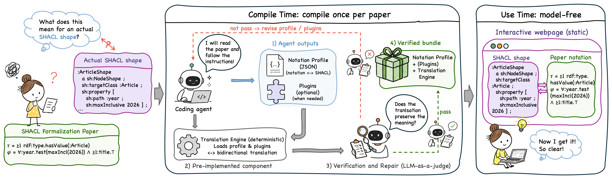

# FormaLens: Compile-Time Autoformalization for Understanding SHACL Formalization Papers with Coding Agents

FormaLens is a compile-time autoformalization harness. Given a research paper
that defines a formal notation for SHACL, a coding agent compiles the paper
**once** into a self-contained interactive webpage that translates between
actual SHACL shapes and the paper's own notation, in both directions, with no
model calls at use time.



The harness ships the fixed components (the deterministic Translation Engine,
the Notation Profile schema, the webpage template, and the task instructions);
the agent writes only two things per paper: a **Notation Profile**
(`profile.json`, the declarative mapping between SHACL constructs and the
paper's notation) and, when the paper assumes a normalized form,
**normalization plugins**. The agent then verifies its own profile rule by
rule against the paper (LLM-as-judge, quoting the defining passages as
grounds) and repairs it until every check passes.

## Demo

We ran FormaLens on the SHACL2RML paper, accepted at the ISWC 2026 Research
Track; the resulting interactive webpage is accessible at
<https://dtai-kg.github.io/FormaLens/demo/shacl2rml>.

## Setup

```bash
git clone https://github.com/dtai-kg/FormaLens.git && cd formalens
npm install
```

## Compiling a paper (example with Claude Code)

Put the paper PDF in the repo (e.g. `paper.pdf`) and start your coding agent.
With Claude Code:

```bash
claude
```

Then instruct it to follow the skill:

> Read skill/SKILL.md and compile paper.pdf into a translator webpage,
> following it end to end.

The agent works through the six steps of SKILL.md: locating the paper's
notation definitions, writing `profile.json` (mapping rules with paper sources
and a positive supported list), writing normalization plugins per
`skill/plugin-guide.md` when needed, checking every rule against the paper as
an LLM-as-judge and repairing until it passes, and assembling the webpage. Any
other coding agent such as Codex reads the same `skill/SKILL.md`; the
instructions are tool-agnostic.

The deliverable is a single offline `webapp/dist/index.html`: paste shapes to
see the paper's notation (subexpression↔source-line highlighting, per-operator
citations), assemble formulas from menus to get shapes back, and read the
rule-by-rule review on the transparency tab.

## Repository layout

| Path | Role |
|---|---|
| `engine/` | Fixed deterministic Translation Engine (TypeScript, browser + Node): Turtle → ShapeTree → paper notation, and menu-built formulas → shapes |
| `schema/profile.schema.json` | Fixed JSON Schema for the Notation Profile |
| `webapp/` | Fixed webpage template (Vite, single-file offline build) |
| `skill/` | Task instructions for the compiling agent: `SKILL.md` (six-step pipeline) and `plugin-guide.md` (plugin contract) |
| `compilation/` | The compilation slot: the agent writes `profile.json`, `plugins/`, and `review.json` here; the webpage build assembles whatever the slot contains |
| `tools/compose-check.ts` | Composition check used in the verify-and-repair loop (step 5.4 of SKILL.md) |
| `demo/shacl2rml/` | A finished example: the SHACL2RML paper compiled into its translator webpage (`index.html`, opens offline; [live page](https://dtai-kg.github.io/FormaLens/demo/shacl2rml)) |
| `assets/shacl-shacl.ttl` | W3C recommendation appendix shapes, used by the webpage's well-formedness gate |

## Requirements

Node ≥ 20. All dependencies are exact-pinned in `package-lock.json`. The
engine and the built webpage make no network calls and embed no model.

## License

Apache-2.0, see `LICENSE`.
